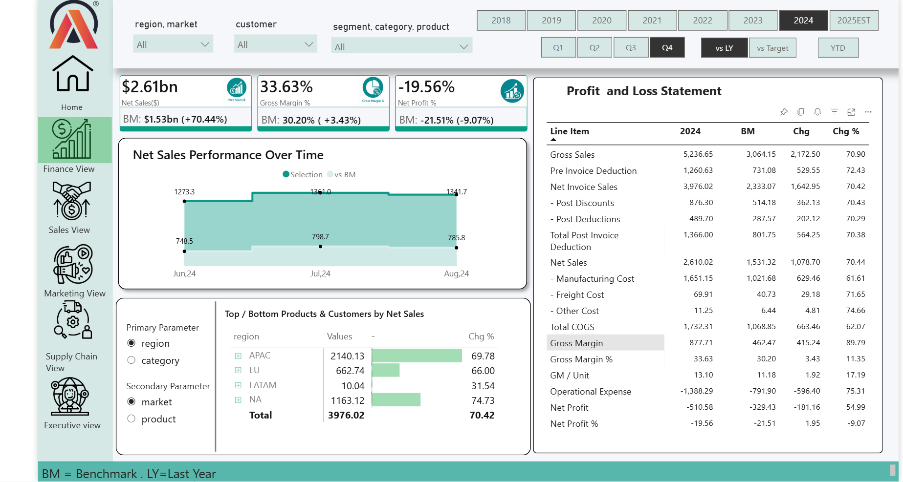
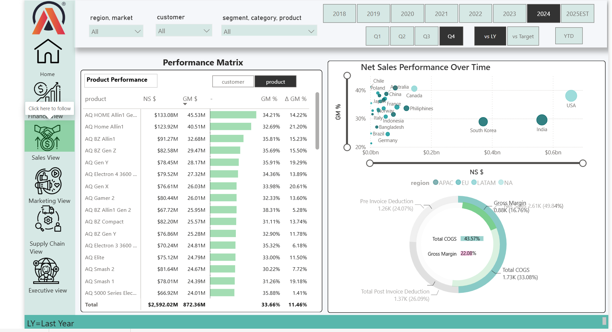
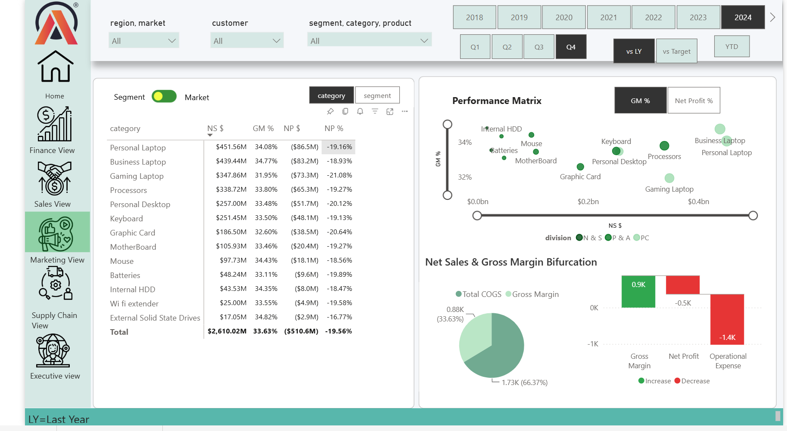
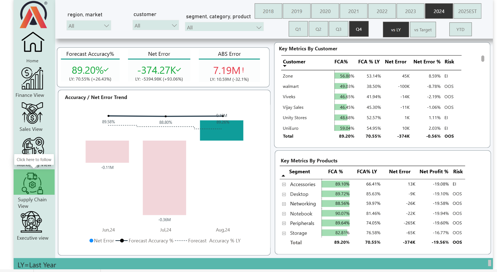
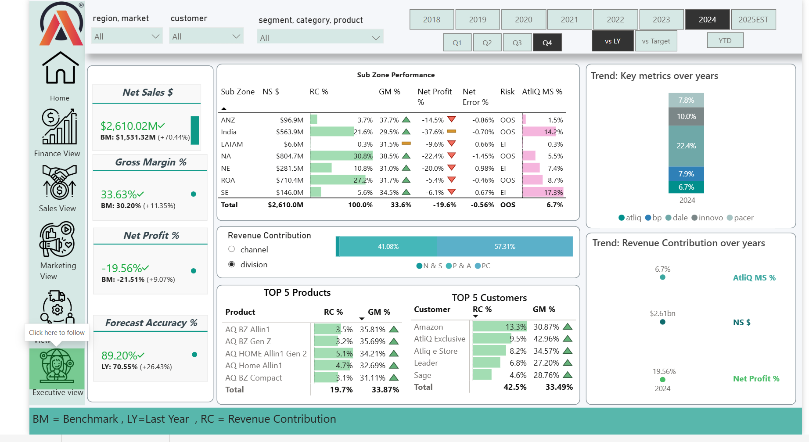
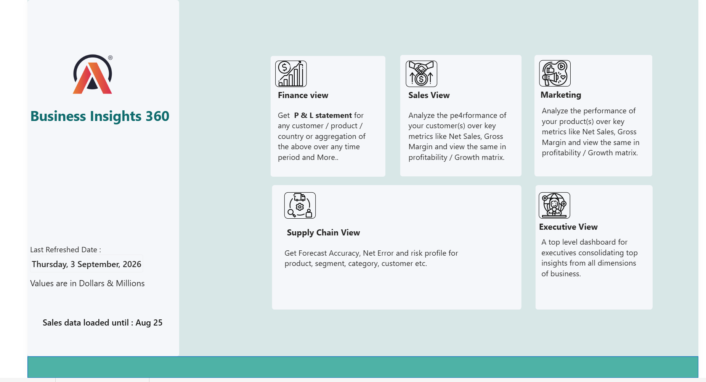

# AtliQ Hardware – Business Insights 360 | Power BI

> **From MySQL Data → Data Modeling → DAX → Business Analysis → Business Insights**

## 🔗 Live Interactive Dashboard

**[View the Power BI Dashboard](https://app.powerbi.com/view?r=eyJrIjoiOTk2Y2RkNGMtMThjZC00MjQ5LTgwOGQtYWMyYWJlMTIyMTViIiwidCI6ImM2ZTU0OWIzLTVmNDUtNDAzMi1hYWU5LWQ0MjQ0ZGM1YjJjNCJ9)**

---

## 📌 Project Overview

AtliQ Hardware is a **fictional, fast-growing computer hardware and accessories company** operating across multiple markets.

As the business expanded, management needed better visibility into performance across **Finance, Sales, Marketing, and Supply Chain**.

To address this need, I developed an interactive **Business Insights 360 dashboard in Power BI**, connecting to data from **MySQL** and bringing key business metrics into a single analytical solution.

The dashboard helps stakeholders move from **high-level KPIs to detailed analysis**, identify performance gaps, and ask better business questions.

> **Note:** AtliQ Hardware is a fictional company used for this learning/project case study.

---

## 🎯 Business Objectives

- Monitor financial performance and profitability
- Analyze customer and product sales performance
- Compare market and regional performance
- Identify gaps between revenue, margins, and profitability
- Evaluate forecast accuracy and supply-chain performance
- Enable interactive analysis using filters and parameters
- Help stakeholders identify areas requiring deeper investigation

---

## 🛠️ Tools & Skills

**Data & Analysis**
- MySQL
- Power Query
- DAX
- Data Modeling
- Table Relationships

**Power BI**
- KPI Cards
- Slicers & Filters
- Field Parameters
- Time-based Analysis
- Performance Matrices
- Scatter Plots
- Trend Analysis
- Bookmarks
- Page Navigation
- Interactive Dashboard Design

**Analytical Skills**
- Financial & Profitability Analysis
- Customer & Product Analysis
- Market/Region Comparison
- Forecast Analysis
- Business Insight Generation

---

# 📊 Dashboard Views

## 1. Finance View

The Finance View provides a detailed understanding of financial performance through:

- Net Sales
- Gross Margin %
- Net Profit %
- Profit & Loss Statement
- Net Sales Performance Over Time
- Top/Bottom Products & Customers
- Benchmark/previous-year comparisons

### Key observation

In the selected 2024 view, Net Sales are approximately **$2.61bn**, Gross Margin is **33.63%**, while Net Profit is **-19.56%**.

This highlights an important business question: **strong revenue performance does not necessarily translate into positive profitability**.

The P&L helps investigate where revenue is being consumed through costs, deductions, and operating expenses.

---

## 2. Sales View

The Sales View focuses on **customer and product performance**.

It analyzes:

- Net Sales
- Gross Margin
- Gross Margin %
- Change in Gross Margin %
- Customer Performance
- Product Performance
- Net Sales vs Gross Margin
- Regional performance

The performance matrix can dynamically switch between customer and product analysis.

### Key observation

A high-revenue customer or product is not automatically the most profitable.

This encourages further investigation into **pricing, discounts, product mix, and cost-to-serve**.

---

## 3. Marketing View

The Marketing View compares performance across **markets and product categories**.

It analyzes:

- Net Sales
- Gross Margin %
- Net Profit
- Net Profit %
- Category/Segment Performance
- Market/Region Comparison
- Profitability Matrix
- Net Sales & Gross Margin Bifurcation

### Key observation

In the selected view, several categories contribute substantial sales while still showing **negative Net Profit**.

This demonstrates why revenue contribution alone is not enough to evaluate business performance.

Management can investigate **pricing, discounts, product mix, and operating expenses** to understand the profitability gap.

---

## 4. Supply Chain View

The Supply Chain View focuses on **forecasting and demand-planning performance**.

It analyzes:

- Forecast Accuracy %
- Net Error
- Absolute Error
- Forecast Accuracy Trend
- Customer-level performance
- Product/Segment-level performance
- Risk indicators

### Key observation

In the selected 2024 vs LY view, overall Forecast Accuracy is **89.20%**, compared with **70.55%** in the previous-year comparison shown on the dashboard.

The dashboard also highlights customer and product areas with **OOS (Out of Stock) and EI (Excess Inventory) risk indicators**.

> **A forecast error is not just a number — it can eventually become an inventory or customer problem.**

---

## 5. Executive View

The Executive View provides a high-level summary for management.

It brings together:

- Net Sales
- Gross Margin %
- Net Profit %
- Forecast Accuracy %
- Sub-zone Performance
- Revenue Contribution
- Top Customers
- Top Products
- Business Trends

### Business purpose

The Executive View helps decision-makers quickly understand **what is happening across the business and where deeper investigation may be required**.

> **The key business story is not just revenue growth — it is whether that growth can be converted into sustainable profitability.**

---

# 💡 Key Business Insights

### 1. Revenue growth does not guarantee profitability
Strong Net Sales can coexist with negative Net Profit, making cost and expense management an important area of investigation.

### 2. Gross Margin improvement may still not be enough
Even when Gross Margin improves, high operating expenses can continue to put pressure on Net Profit.

### 3. High sales do not always mean high business value
Customer and product performance should be evaluated using both **revenue and margin**, not revenue alone.

### 4. Market performance needs a profitability perspective
A market with strong sales contribution may still require attention if its profitability is weak.

### 5. Forecasting directly affects operations
Forecast accuracy influences inventory levels, stock availability, working capital, and customer experience.

### 6. Interactive analysis improves decision-making
Filters, parameters, bookmarks, and navigation allow stakeholders to move from an overall view to specific customers, products, markets, and time periods.

> **Note:** These observations are based on the selected filters/views demonstrated in the dashboard and should not be treated as universal company-wide conclusions.

---

# 🧠 Key Learning From the Project

This project strengthened my understanding of both **technical Power BI skills and analytical thinking**.

I learned how to:

- Connect Power BI with MySQL
- Transform and prepare data
- Create table relationships
- Build a structured data model
- Create DAX measures
- Build business KPIs
- Perform time-based comparisons
- Use slicers and filters
- Implement field parameters
- Use bookmarks and page navigation
- Design interactive dashboards
- Translate numbers into business insights

### Biggest takeaway

Power BI is not just about creating charts.

As an analyst, the important questions are:

**What happened?**  
**Why did it happen?**  
**What does it mean for the business?**  
**What should we investigate next?**

This project helped me move from simply **visualizing data to thinking more like an analyst**.

---

# 🖼️ Dashboard Preview

### Home

### Finance

### Sales

### Marketing

### Supply Chain

### Executive View

---

# 🚀 Project Workflow

**MySQL Data**  
↓  
**Data Transformation**  
↓  
**Data Modeling**  
↓  
**DAX & KPIs**  
↓  
**Interactive Power BI Dashboard**  
↓  
**Business Analysis**  
↓  
**Business Insights**

---

## 👤 About

**Aspiring Data Analyst**

**Skills:** Power BI | SQL | Advanced Excel | Data Analysis

---

## 🙏 Acknowledgement

This project was developed as part of my learning journey with **Codebasics**, under the guidance of **Dhaval Patel**.

The project helped me understand how business intelligence can be used not only for visualization, but also for structured analysis and business decision-making.

